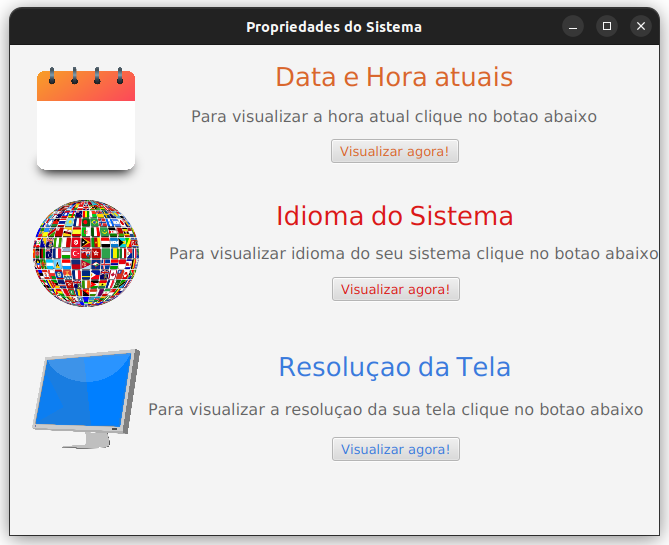

# Prorpiedades do Sistema APP

## Premissa

Código para constrir uma interface gráfica utilizando o JavaFX e SceneBuilder, obtendo as propriedades do sistema, tais como hora atual, idioma e resolução da tela.

